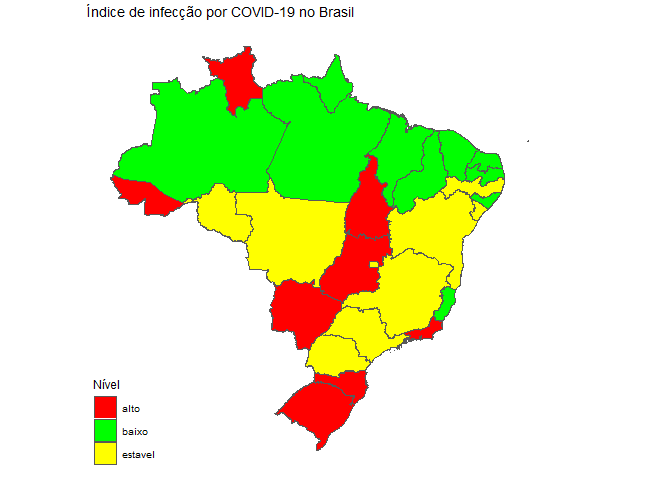

Mapa do Brasil
================

Carrega as libraries

``` r
library(tidyverse)
library(sf)
library(rgdal)
library(rgeos)
# https://cran.r-project.org/web/packages/geobr/vignettes/intro_to_geobr.html
library(geobr)
library(ggthemes)
```

Le o arquivo de UFs com seus índices

``` r
df_estados_indice <- read_csv2("data/uf_nivel.csv", col_names = TRUE,
                          locale = locale(encoding = "ISO-8859-1"), col_types = NULL)
```

``` r
df_estados <- read_state(year=2018) %>% 
   rename("UF" = name_state) %>% 
  mutate(UF=str_replace_all(UF, " De "," de ")) %>% 
  mutate(UF=str_replace_all(UF, " Do "," do "))
#>   |                                                                              |                                                                      |   0%  |                                                                              |===                                                                   |   4%  |                                                                              |=====                                                                 |   7%  |                                                                              |========                                                              |  11%  |                                                                              |==========                                                            |  15%  |                                                                              |=============                                                         |  19%  |                                                                              |================                                                      |  22%  |                                                                              |==================                                                    |  26%  |                                                                              |=====================                                                 |  30%  |                                                                              |=======================                                               |  33%  |                                                                              |==========================                                            |  37%  |                                                                              |=============================                                         |  41%  |                                                                              |===============================                                       |  44%  |                                                                              |==================================                                    |  48%  |                                                                              |====================================                                  |  52%  |                                                                              |=======================================                               |  56%  |                                                                              |=========================================                             |  59%  |                                                                              |============================================                          |  63%  |                                                                              |===============================================                       |  67%  |                                                                              |=================================================                     |  70%  |                                                                              |====================================================                  |  74%  |                                                                              |======================================================                |  78%  |                                                                              |=========================================================             |  81%  |                                                                              |============================================================          |  85%  |                                                                              |==============================================================        |  89%  |                                                                              |=================================================================     |  93%  |                                                                              |===================================================================   |  96%  |                                                                              |======================================================================| 100%
```

``` r
df_brasil_indice <- df_estados %>% 
  left_join(df_estados_indice, by = "UF")
```

Desenha o mapa

``` r
my_colors <- (c(alto = "red", estavel = "yellow", baixo = "green"))
df_brasil_indice %>% 
  ggplot() +
  geom_sf(aes(fill = Nivel)) +
  scale_fill_manual(name = "Nível", values = my_colors) +
  theme_map() + 
    labs(x = NULL, 
         y = NULL,
         title = "Índice de infecção por COVID-19 no Brasil")
```


